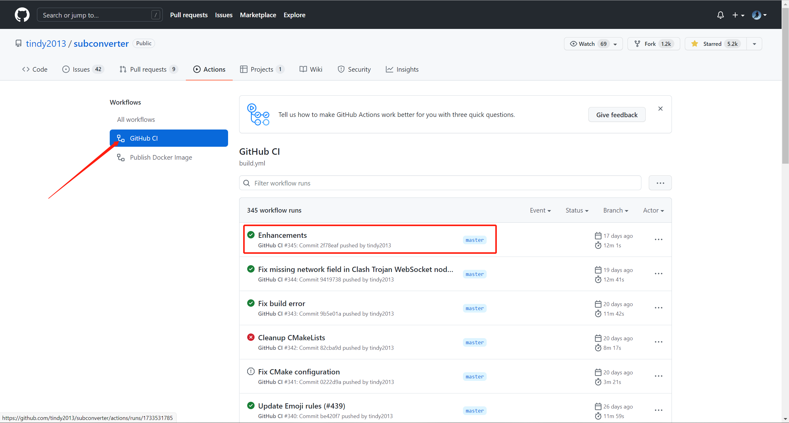
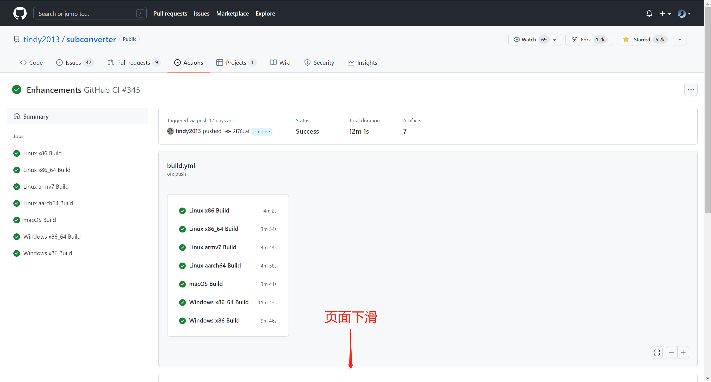
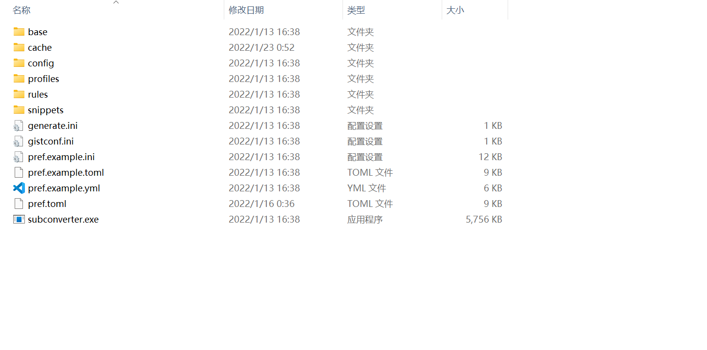
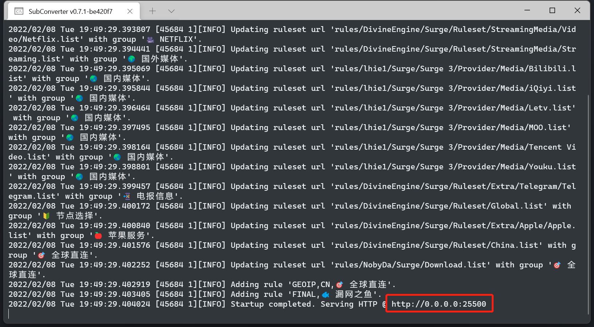
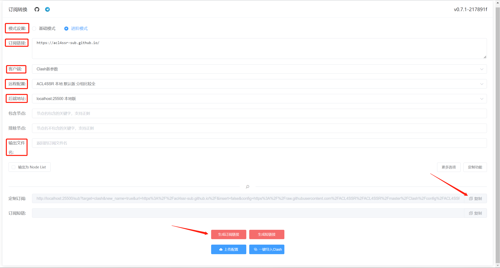
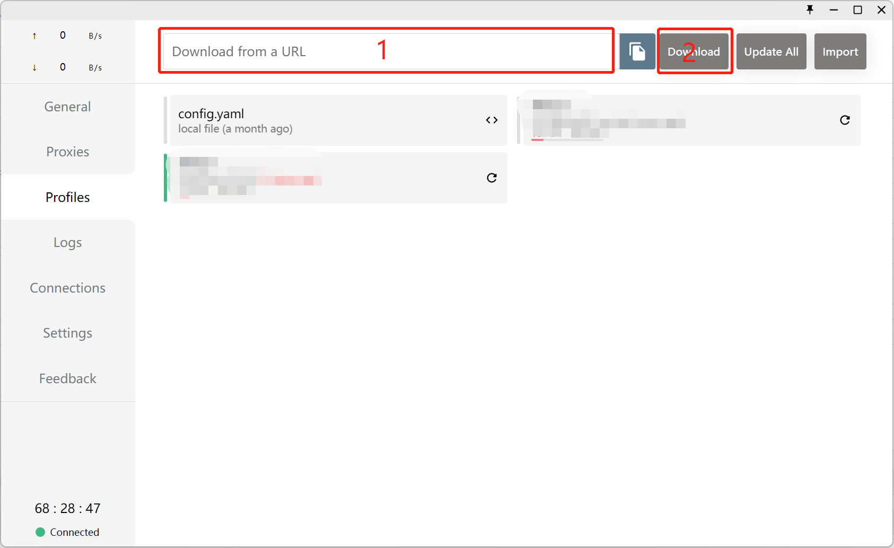

# 订阅链接转换简单教程

## 准备工作

- subconverter 工具
  1. 点击链接 [tindy2013/subconverter Actions](https://github.com/tindy2013/subconverter/actions/workflows/build.yml)
  2. 点击左侧的 `Github CI`，点击列表中第一个编译通过的项，如下图
     
  3. 页面下滑，选择对应的的平台的软件，然后下载，如下图
     
     
- [ACL4SSR 在线订阅转换](https://acl4ssr-sub.github.io/) 网页
- 一个订阅链接，支持 v2ray, ss 等

## 步骤

1. 解压 subconverter，如下图
   
2. 运行 subconverter.exe

   - 你可以直接点击 subconverter.exe 运行
   - 或者在当前路径打开命令行工具，执行 `./subconverter.exe`

   运行成功后显示服务端口号（默认 25500）
   

3. 打开 [ACL4SSR 在线订阅转换](https://acl4ssr-sub.github.io/) 网页，配置如下信息

   - 订阅链接。自行填写
   - 客户端默认 `Clash新参数` 不用改
   - 远程配置。第一次务必选择 `ACL4SSR 本地 默认版 分组比较全` ，待本机能够科学上网后，再将远程配置改为带 `Online` 的选项，比如 `ACL4SSR_Online 默认版 分组比较全(与Github同步)`，所以第四步会有两次导入
   - 后端地址。务必选择 `localhost:25500 本地版`，对应第二步本地运行的 subconverter
   - 输出文件名。自行填写
   - 右侧还有更多选项和定制功能，你了解是什么就选，不了解就不用动它了

   填写好后应该如下图所示
   

4. 点击 `生成订阅链接`，会自动复制链接，然后在 clash 中导入。如下图所示
   

5. 没什么错误就可以关掉 subconverter 了，后续如果需要更新订阅再打开它
